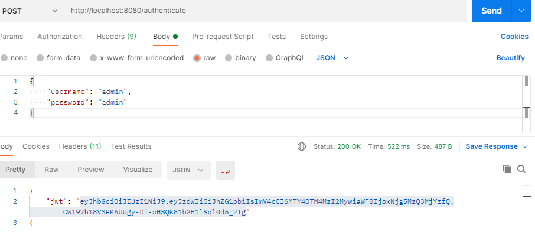
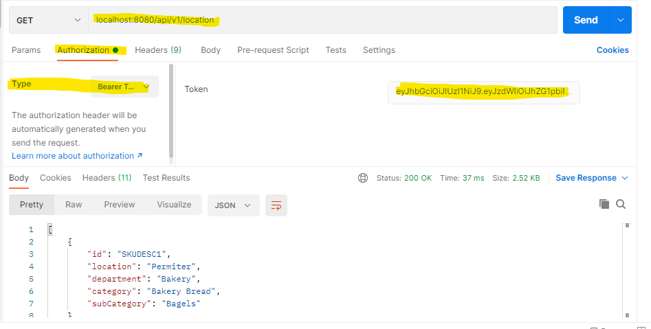

# **_sku-data-management_**

###### To run the application please follow the below steps

1. unzip the file or download the project from following GitHub URL

   `https://github.com/madhukarsuryawanshi/inmar/tree/main`
   

2. Load the project in IDE
3. Build the project using below command
   
        open cmd -> mvn clean install
4. Run the application
5. As these api's are secure, generate the JWT token by passing username and password. To generate JWT token below are the steps
    
    a) Open postman
   
    b) Hit url - POST -> http://localhost:8080/authenticate and provide the below request body in postmen

   `{
   "username": "admin",
   "password": "admin"
   } `      
   

   

6. Copy JWT token.
7. In postman select GET-> `localhost:8080/api/v1/location`, go to `Authorization` section and click `type` dropdown select the `Bearer token`. In right hand side paste the generated token in `Token` textbox.
   

   
   

8. Repeat the 7th step for below URLs.
   
   `localhost:8080/api/v1/location/Permiter/department`
   
   `localhost:8080/api/v1/location/Permiter/department/Floral/category`
   
   `localhost:8080/api/v1/location/Permiter/department/Bakery/category/Bakery Bread/subcategory`
   
   `localhost:8080/api/v1/location/Permiter/department/Bakery/category/Bakery Bread/subcategory/Bagels`

###### _Note: For this application H2 database has been used, while start up the application data will be loaded in H2 database._

